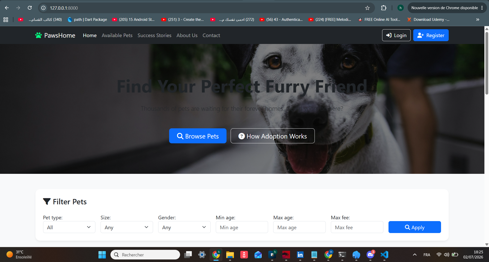
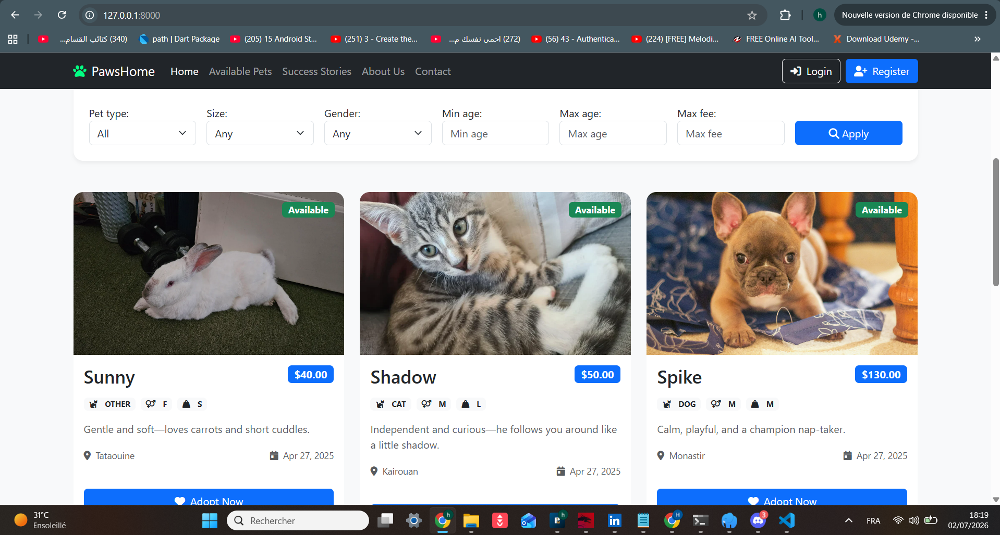
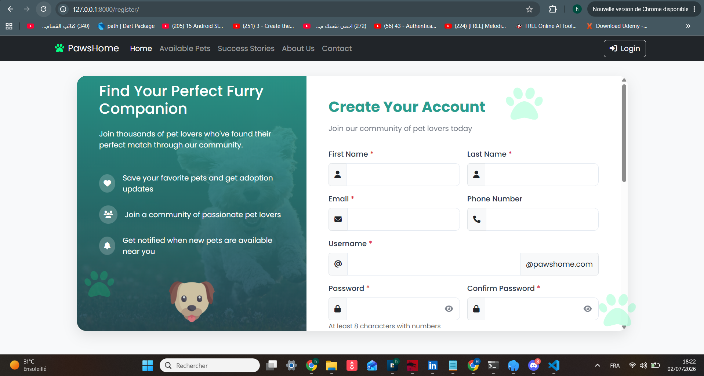
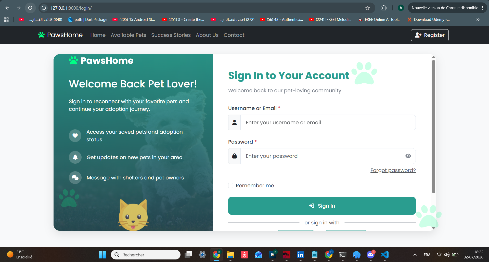
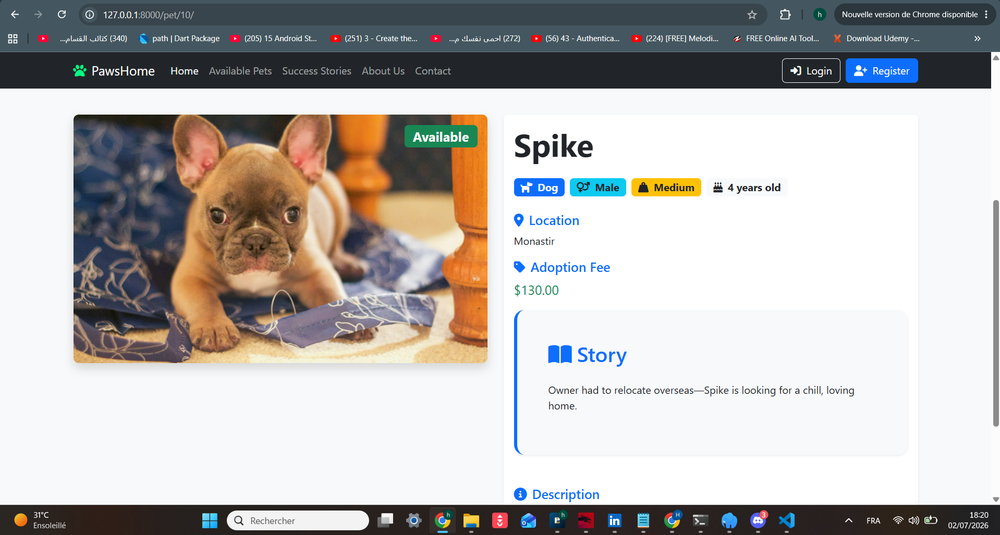
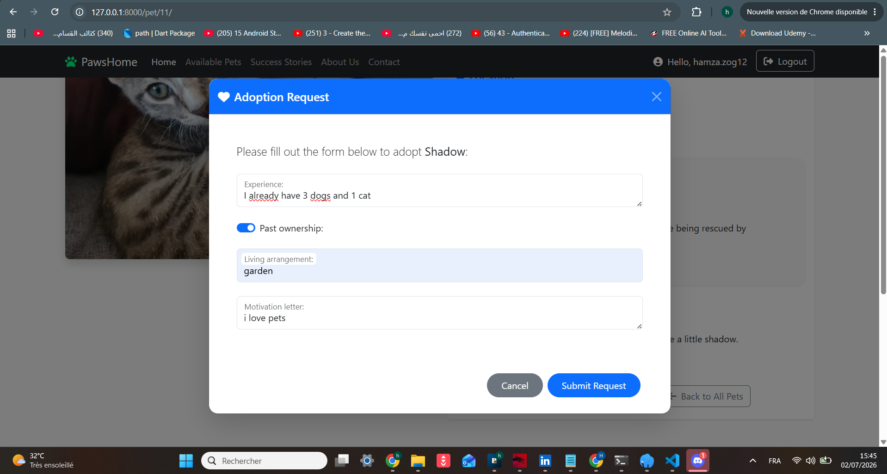
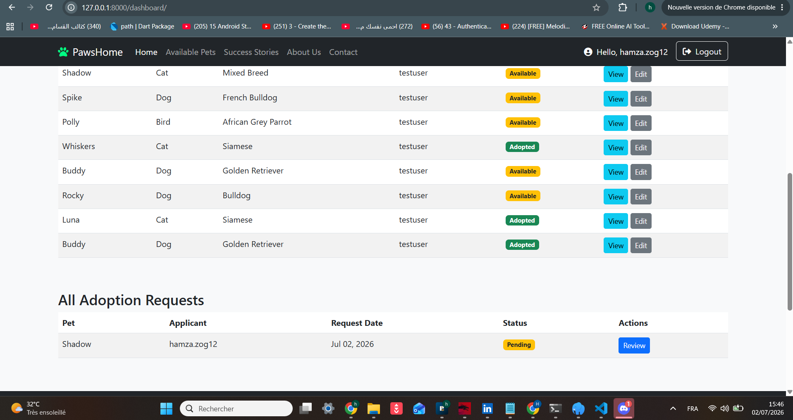

# 🐾 PawsHome — Pet Adoption Platform


A full-featured **Django web application** for pet adoption in Tunisia. Users can browse available pets, filter by preferences, submit adoption requests, and administrators can manage pets and review applications through a dedicated dashboard.

---

## ✨ Features

| Feature | Description |


| 🔐 **Custom User Authentication** | Extended User model with roles (Admin/Staff/Member), profile fields, and session management |

| 🐕 **Pet Listing & Filtering** | Browse pets with filters by type, gender, size, age, and adoption fee |

| 📄 **Pet Detail Pages** | Full pet profiles with images, descriptions, stories, and adoption forms |

| 📝 **Adoption Request System** | Users submit detailed applications; admins approve or reject with one click |

| 📊 **Admin Dashboard** | Protected dashboard to manage all pets and adoption requests |

| 🖼️ **Image Uploads** | Pet photos handled via Django's media system |

| 📱 **Responsive Design** | Mobile-friendly Bootstrap 5 UI with custom theming |

| ⏱️ **Session Security** | 30-minute inactive timeout with browser-close expiry |

---

## 🖼️ Screenshots

### 🏠 Homepage


### 🔍 Pet Listings with Filters


### 🔐 Authentication
| Register | Login |



 

### 📝 Adoption Flow

 

 

### 📊 Admin Dashboard


---

## 🚀 Quick Start

### Prerequisites
- Python 3.10+
- pip

### 1. Clone & Navigate
```bash
git clone https://https://github.com/Hamza-zgh/PawsHome-PetAdoption.git
cd pawshome
```
### 2. Create Virtual Environment
```
python -m venv venv

# Windows
venv\Scripts\activate

# Mac/Linux
source venv/bin/activate
```
### 3. Install Dependencies
```
pip install -r requirements.txt
```
### 4. Configure Environment
```
# Copy the example env file
cp .env.example .env
# Edit .env and set your SECRET_KEY
```
### 5. Run Migrations
```
python manage.py migrate
```

### 6. Create Superuser
```
python manage.py createsuperuser
```

### 7. Run Server
```
python manage.py runserver
```
Visit: http://127.0.0.1:8000/

### 🗄️ Database Options
SQLite (Default — Easiest)

No configuration needed. Perfect for demos and development.

MySQL (Production)

Set in your .env:
```env
DB_ENGINE=mysql
DB_NAME=pet_adoption_tn
DB_USER=your_user
DB_PASSWORD=your_password
DB_HOST=localhost
DB_PORT=3306
```
### 📁 Project Structure
```env
PetAdoptionTunisia/
├── PetAdoption/           # Project settings
│   ├── settings.py
│   ├── urls.py
│   └── wsgi.py
├── users/                 # Custom User auth app
│   ├── models.py          # Extended User model
│   ├── views.py           # Register/Login/Logout
│   ├── forms.py           # User forms
│   └── templates/         # Auth templates
├── pets/                  # Core pet adoption app
│   ├── models.py          # Pet & AdoptionDemand
│   ├── views.py           # Home, Details, Dashboard
│   ├── forms.py           # Pet & Filter forms
│   ├── urls.py            # URL routing
│   └── templates/         # Pet templates
├── media/                 # Uploaded pet images
├── manage.py
├── requirements.txt
└── .env
```
### 🔧 Admin Access
1. Create a superuser: python manage.py createsuperuser

2. Log in at /admin/

3. Set a user's is_staff = True to grant dashboard access

4. Access the dashboard at /dashboard/

### 🛡️ Security Notes
SECRET_KEY is loaded from environment variables

Debug mode disabled by default in production

CSRF protection enabled on all forms

Session timeout after 30 minutes of inactivity

Admin dashboard protected by @user_passes_test(is_admin)

### 🛠️ Tech Stack

| Layer    | Technology                             |

| -------- | -------------------------------------- |

| Backend  | Django 5.2, Python 3.10+               |

| Frontend | Bootstrap 5, HTML5, CSS3, Font Awesome |

| Database | SQLite (dev) / MySQL (prod)            |

| Auth     | Django Custom User Model               |

| Media    | Pillow (ImageField)                    |
